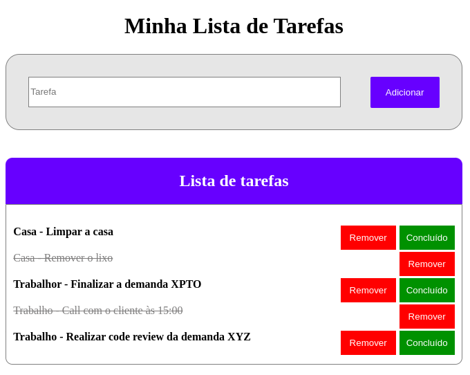

# Todo list

> Projeto que utilizei no processo de mentoria com os mentorados.

Todo List é um app para gerênciamento de tarefas diárias.



## Requisitos

Pode ser utilizado em qualquer navegador

## Tecnologias

O app foi implementado utilizando HTML, CSS e Javascript vanila.

## Funcionalidades

- Adiconar;
- Concluir;
- Remover.

## Licença

[MIT](/LICENSE)

## Como utilziar

Realize o clone do projeto.

```bash
git clone git@github.com:Diego-Brocanelli/mentoria-todolist.git
```

Acesse a pasta `mentoria-todolist`.

Abra o arquivo `index.html` em seu navegador de preferência.


